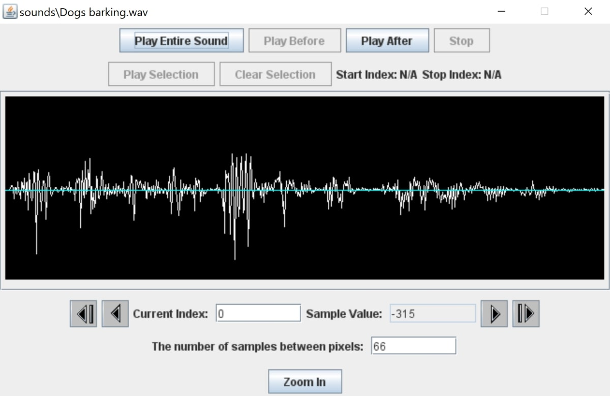

# Sounds-in-JES
This is an example that allows you to import and explore sounds using the JES application.

## To Run

* Open the Sounds.py file (inside JES-example) using the JES application.
* Run the playSound() or exploreSound() function using the command line.
* Select a compatible WAV file. 

## Example

